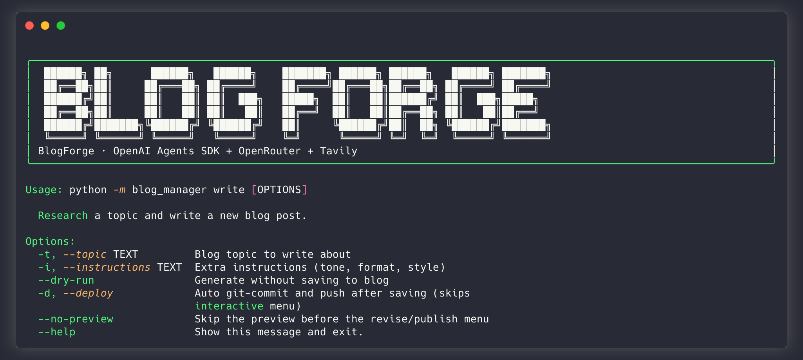
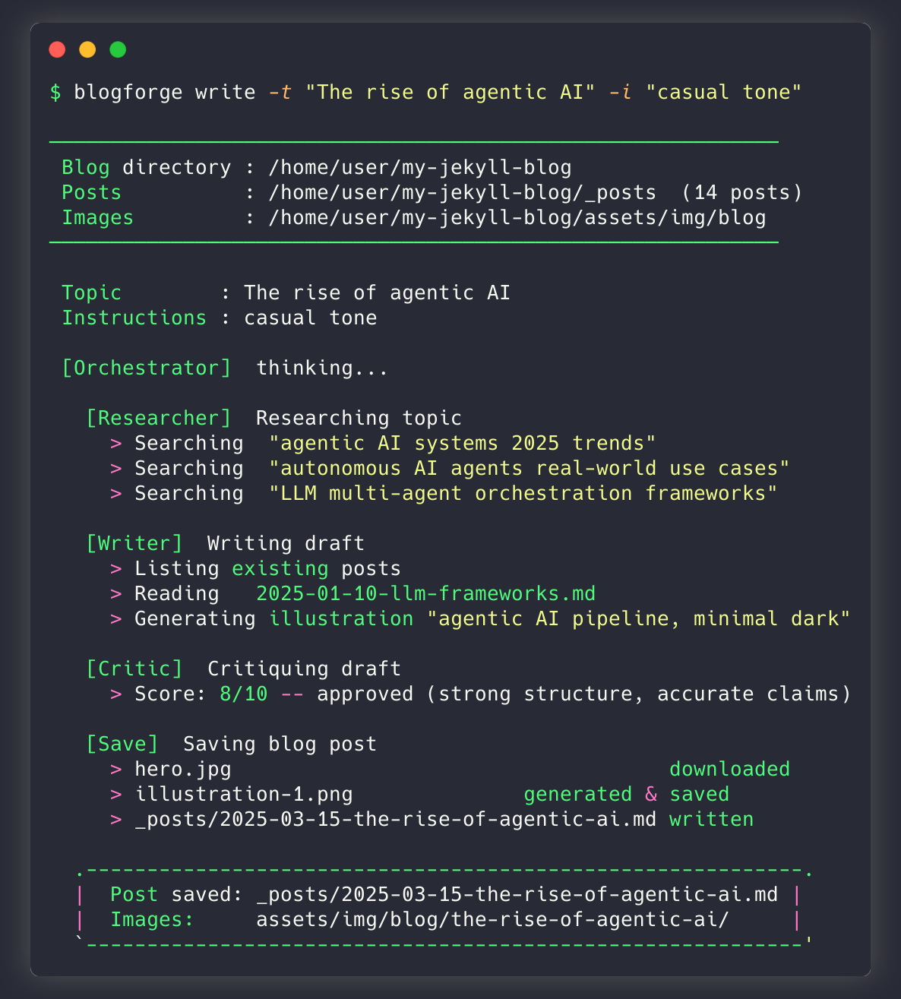

<div align="center">

```
 ██████╗ ██╗      ██████╗  ██████╗    ███████╗ ██████╗ ██████╗  ██████╗ ███████╗
 ██╔══██╗██║     ██╔═══██╗██╔════╝    ██╔════╝██╔═══██╗██╔══██╗██╔════╝ ██╔════╝
 ██████╔╝██║     ██║   ██║██║  ███╗   █████╗  ██║   ██║██████╔╝██║  ███╗█████╗
 ██╔══██╗██║     ██║   ██║██║   ██║   ██╔══╝  ██║   ██║██╔══██╗██║   ██║██╔══╝
 ██████╔╝███████╗╚██████╔╝╚██████╔╝   ██║     ╚██████╔╝██║  ██╗╚██████╔╝███████╗
 ╚═════╝ ╚══════╝ ╚═════╝  ╚═════╝    ╚═╝      ╚═════╝ ╚═╝  ╚═╝ ╚═════╝ ╚══════╝
```

**AI-powered multi-agent system that researches, writes, and publishes Jekyll blog posts automatically.**

[](https://python.org)
[](LICENSE)
[](https://github.com/levulinh/blogforge/commits/main)
[](https://github.com/levulinh/blogforge/stargazers)
[](https://github.com/levulinh/blogforge/issues)
[](https://github.com/levulinh/blogforge/pulls)

[](https://github.com/openai/openai-agents-python)
[](https://openrouter.ai)
[](https://tavily.com)

</div>

---

BlogForge is a **multi-agent CLI tool** that turns a topic into a publication-ready Jekyll blog post — complete with web research, AI-generated illustrations, quality review, and automatic file saving. No manual writing. No copy-pasting images. Just run it and publish.

## How It Works

```
You type a topic
      │
      ▼
┌─────────────────────────────────────────────────────────────┐
│                      Orchestrator Agent                     │
│                                                             │
│  1. Researcher ──► Tavily web search (facts + images)       │
│  2. Writer     ──► Drafts post + generates illustrations    │
│  3. Critic     ──► Scores 1-10, requests revisions if < 7   │
│  4. Writer     ──► Revises (if needed, max 2 rounds)        │
│  5. Save       ──► Downloads images, writes Jekyll Markdown │
└─────────────────────────────────────────────────────────────┘
      │
      ▼
_posts/2025-01-15-your-topic.md  ✓
assets/img/blog/your-topic/      ✓
```

All agents, image generation, and reasoning are powered by a single **OpenRouter** API key. Swap models per-agent without changing code.

## Demo

<div align="center">

**CLI banner & command reference**



**Agent pipeline — research → write → critique → save**



</div>

## Features

- **Fully automated pipeline** — research → draft → review → save, no human in the loop required
- **Quality gating** — Critic agent scores every post (1-10) and blocks low-quality output; revision loops run automatically
- **AI illustrations** — Generates images via OpenRouter (DALL-E 3, Gemini Imagen, etc.) and embeds them with Jekyll-compatible includes
- **Web research** — Tavily search brings in current facts, sources, and real images from the web
- **Jekyll-native output** — Correct frontmatter, `figure.html` includes, date-slug filenames, local image paths
- **Per-agent model selection** — Run your orchestrator on Claude Opus, writer on Sonnet, researcher on Haiku — all independently configurable
- **Rich terminal UI** — Live streaming output, agent step visualization, post preview in terminal
- **Dry-run mode** — Generate and preview without saving to your blog

## Quick Start

### 1. Install

```bash
git clone https://github.com/levulinh/blogforge.git
cd blogforge

# With uv (recommended)
uv sync

# Or with pip
python3 -m venv .venv && source .venv/bin/activate
pip install -e .
```

### 2. Configure

```bash
cp .env.example .env
```

Edit `.env` with your API keys:

```env
OPENROUTER_API_KEY=sk-or-...    # https://openrouter.ai/keys
TAVILY_API_KEY=tvly-...         # https://app.tavily.com
BLOG_DIR=/path/to/your/jekyll   # root of your Jekyll repo
```

### 3. Run

```bash
# Interactive — prompts for topic and instructions
python -m blog_manager

# Or provide everything via flags
python -m blog_manager --topic "The rise of agentic AI" --instructions "casual tone, include code examples"

# Preview without saving
python -m blog_manager --topic "My topic" --dry-run
```

## Configuration

### Required

| Variable | Description |
|----------|-------------|
| `OPENROUTER_API_KEY` | OpenRouter key — used for all LLM calls and image generation |
| `TAVILY_API_KEY` | Tavily key — used for web search with images |
| `BLOG_DIR` | Absolute path to the root of your Jekyll blog repository |

### Optional — Model Selection

| Variable | Default | Description |
|----------|---------|-------------|
| `OPENROUTER_MODEL` | `anthropic/claude-3.5-sonnet` | Default model for all agents |
| `OPENROUTER_IMAGE_MODEL` | `openai/dall-e-3` | Image generation model |
| `ORCHESTRATOR_MODEL` | inherits default | Override orchestrator model |
| `RESEARCHER_MODEL` | inherits default | Override researcher model |
| `WRITER_MODEL` | inherits default | Override writer model |
| `CRITIC_MODEL` | inherits default | Override critic model |
| `OPENROUTER_REASONING_EFFORT` | *(unset)* | `low` \| `medium` \| `high` for reasoning models (e.g. DeepSeek R1) |

### Example: Cost-optimized setup

```env
ORCHESTRATOR_MODEL=anthropic/claude-3.5-sonnet
RESEARCHER_MODEL=anthropic/claude-3-haiku
WRITER_MODEL=anthropic/claude-3.5-sonnet
CRITIC_MODEL=anthropic/claude-3-haiku
```

## CLI Reference

```
python -m blog_manager [OPTIONS]

Options:
  -t, --topic TEXT         Blog topic to write about
  -i, --instructions TEXT  Extra instructions (tone, format, style)
  --dry-run                Generate post but don't save to blog
  --help                   Show this message and exit
```

## Output

Each run produces a publication-ready Jekyll post:

```
$BLOG_DIR/
├── _posts/
│   └── 2025-01-15-the-rise-of-agentic-ai.md   ← frontmatter + content
└── assets/
    └── img/
        └── blog/
            └── the-rise-of-agentic-ai/
                ├── hero.jpg                     ← downloaded/generated images
                └── illustration-1.png
```

The Markdown file includes proper Jekyll frontmatter:

```yaml
---
layout: post
title: "The Rise of Agentic AI"
description: "How autonomous AI agents are changing software development"
tags: [ai, agents, llm]
image:
  path: /assets/img/blog/the-rise-of-agentic-ai/hero.jpg
---
```

## Agents

| Agent | Role | Tools |
|-------|------|-------|
| **Orchestrator** | Runs the full pipeline, coordinates all agents | `research_topic`, `write_blog_post`, `critique_post`, `save_blog_post` |
| **Researcher** | Multi-angle web search, gathers facts and source images | `tavily_search` |
| **Writer** | Reads your existing posts to match your voice, drafts Jekyll Markdown | `list_blog_posts`, `read_blog_post`, `generate_illustration` |
| **Critic** | Reviews quality (clarity, accuracy, structure) and scores 1-10; blocks posts scoring < 7 | *(pure reasoning — no tools)* |
| **Trend Researcher** | Suggests 4-6 trending topics ranked by timeliness | `tavily_search` |

## Requirements

- Python 3.10+
- [uv](https://docs.astral.sh/uv/) (recommended) or pip
- [OpenRouter](https://openrouter.ai/keys) API key
- [Tavily](https://app.tavily.com) API key
- A Jekyll blog repository

## Development

```bash
# Lint + format
uv run ruff check blog_manager/
uv run ruff format blog_manager/

# Type check
uv run ty check blog_manager/
```

## Contributing

Contributions are welcome. Please open an issue first to discuss significant changes.

1. Fork the repo
2. Create a feature branch (`git checkout -b feat/your-feature`)
3. Commit your changes
4. Open a pull request

## License

MIT — see [LICENSE](LICENSE) for details.
